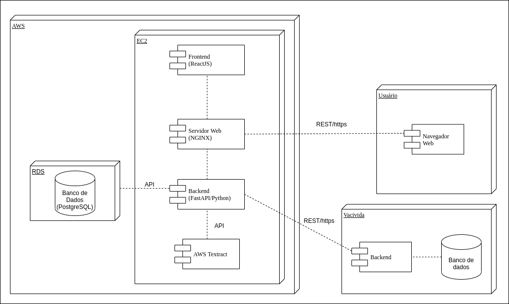
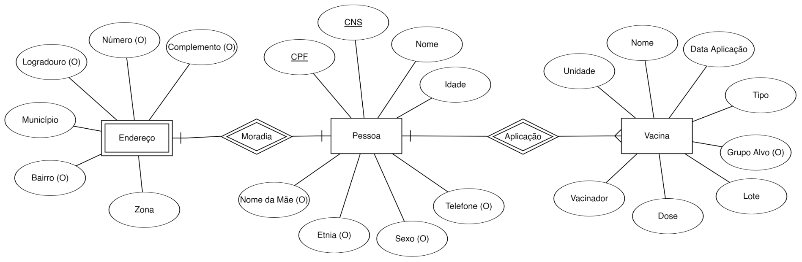
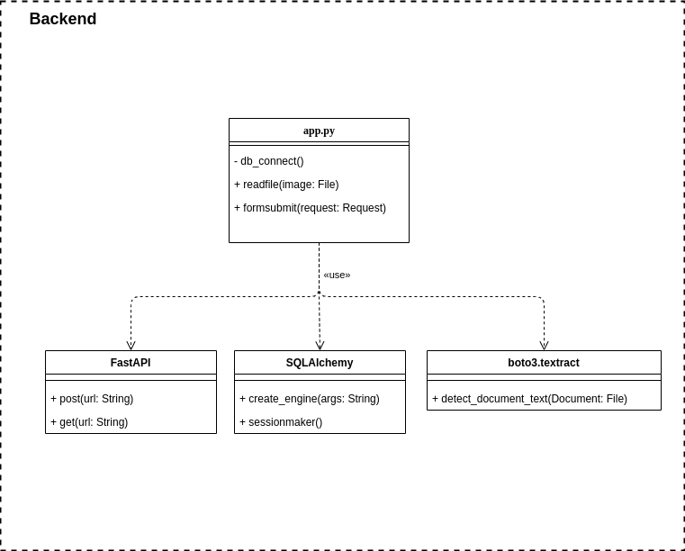

<p align="left">


</p>

# Backend

## 🌐 Aplicação remota

Para acessar a aplicação completa rodando em ambiente de produção no servidor EC2 da Amazon, acesse o link: https://vacinow.tk/. E para acessar a API utilize o seguinte link: https://api.vacinow.tk/.

## 🏁 Rodando o projeto

Para rodar o projeto é necessário ter credenciais válidas pra a integração com a AWS e são necessárias algumas variáveis de ambiente. Dessa forma é definir as seguintes varávies de ambiente com os seguintes valores:

```ENV
AWS_ACCESS_KEY_ID=<O-ID-DA-SUA-CHAVE-AQUI>
AWS_SECRET_ACCESS_KEY=<A-SUA-CHAVE-AQUI>
AWS_DEFAULT_REGION=us-east-1
DB_ENGINE=postgresql
DB_USERNAME=grupodoze
DB_PASSWORD=<SENHA-DO-BD-AQUI>
DB_HOST=vacinow-db.cvwjx0keomx6.sa-east-1.rds.amazonaws.com
DB_PORT=5432
DB_DATABASE=vacinow-db
```

Pode-se colocar essas definições em um arquivo chamado `.env` e colocar o arquivo na raiz do projeto.

Também é necessário possuir o [Docker](https://www.docker.com/) e [docker-compose](https://docs.docker.com/compose/) instalados. Então, para rodar a aplicação com esse arquivo, é necessário executar na raiz do projeto o seguinte comando:


```bash
docker-compose --env-file .env up --build
```

## 📝 Documentação

O diagrama da arquitetura da aplicação inteira pode ser vista a seguir:



O modelo de dados é um banco de dados PostgreSQL, cuja estrutura pode ser vista abaixo:

]

Por fim, o diagrama de classe do projeto do backend ficou como segue:

